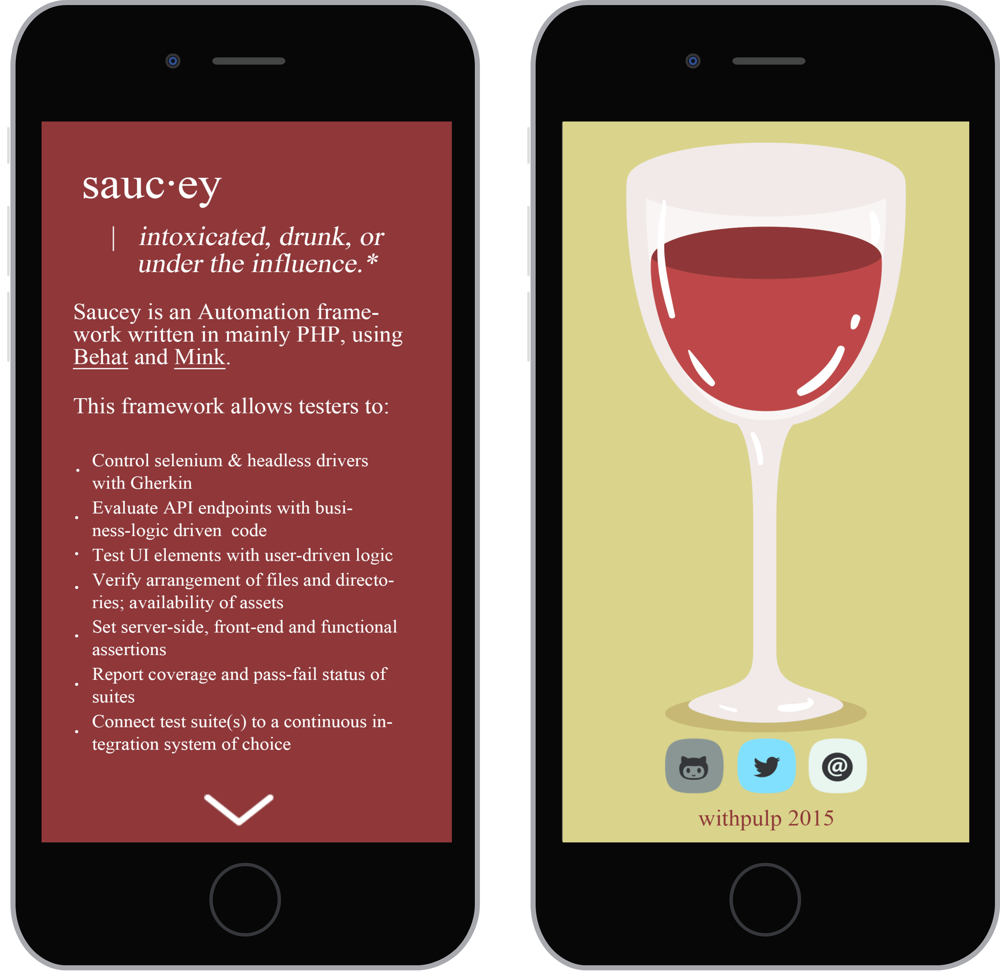

# [saucey](http://www.urbandictionary.com/define.php?term=saucey)



Find out more @ [http://saucey.io](http://saucey.io)  
Fork the repo @ [https://github.com/saucey-io/saucey.git](https://github.com/sajjadhossain/saucey.git)  

## Dependancies
On Mac OS X, (with the exception of LAMP for Windows) this requires:


1. [XCode](https://developer.apple.com/xcode/downloads/) & [Developer Tools](http://stackoverflow.com/questions/9329243/xcode-4-4-and-later-install-command-line-tools)
2. [PHP](http://php-osx.liip.ch/)
3. [Java JDK](http://www.oracle.com/technetwork/java/javase/downloads/jdk7-downloads-1880260.html), see [documentation](http://docs.oracle.com/javase/7/docs/webnotes/install/mac/mac-jdk.html)
4. [cURL](http://curl.haxx.se/download.html)
5. [WAMP](http://www.wampserver.com/en/) `Windows Only`


##Get Started
Hit the ground running. Install all dependancies with composer (may require a php installation, see [php-documents](http://php-osx.liip.ch/)).

From the root of the project, run:

	php composer.phar install

-or-

	php composer.phar update

To obtain the REQUIRED the `behat.yml` file, go to [http://testweb.pw/adcade/Default/behat.yml](http://testweb.pw/adcade/Default/behat.yml). Copy and paste the contents of that file in to a file named `behat.yml`. Then save.

Running your first suite as easy as:  

1. For testing against the `cloud`:

		./saucey drunk @<tag> <environment> <browser>

2. For testing `locally`:

		./start_selnium <environment>

	*then*

		./saucey sober @<tag> <browser>


#Examples
##Local - Tipsy

1. View saucy intro by running:

		./saucey

2. Start selenium via:

		./start_selenium mac

3. Open a new tab with `CMD` + `T`
4. Run a sanity suite via:

		./saucey tipsy check chrome

5. Open a new finder window, then open `reports/check_suite/report.html`
6. Press "Feature: I want to make sure this test suite is up and running" to open detail view for that test suite. You should see:

```gherkin

	Feature: I want to make sure this test suite is up and running

	  As a tester
	  I want to make sure this test suite is up and running
	  So that I can automate continuous integration and regression tests

	@javascript @check
	  Scenario: Check against google.com and search # features/check.feature:8
	    Given I am on "http://google.com"           # FeatureContext::visit()
	    Then the response should contain "Google"   # FeatureContext::assertResponseContains()
	    And I should see "Google Search"            # FeatureContext::assertPageContainsText()
	    When I fill in "q" with "Adcade"            # FeatureContext::fillField()
	    And I wait for 5 seconds                    # FeatureContext::iWaitForSeconds()
	    Then I should see "Adcade"                  # FeatureContext::assertPageContainsText()


```


##Cloud w/ [SauceLabs](saucelabs.com) - Drunk
1. Sign up and register for a FREE [SauceLabs](https://saucelabs.com/) account.
2. Get your username and api-key. *Should be available via /account.* Copy the info into your clipboard.
3. Download the REQUIRED behat.yml from [source](http://testweb.pw/adcade/Default/behat.yml)
4. Open the file with your favorite IDE and replace username:api-key with your real user name and api-key. Save.
5. View saucy intro by running:

		./saucey

6. Run a sanity suite via:

		./saucey drunk check mac chrome

7. Open a new finder window, then open `reports/check_suite/report.html`
8. Press "Feature: I want to make sure this test suite is up and running" to open detail view for that test suite. You should see the same out put as above.


###Mobile & Tablet
For iOS:

	./saucey drunk check ios_phone

	./saucey drunk check ios_tablet

	./saucey drunk check ios_tablet_landscape

For Android:

	./saucey drunk check android_phone

	./saucey drunk check android_tablet

	./saucey drunk check android_tablet_landscape


##Reporting & More
By default, reports are saved to the `reports/` directory. If you ran a suite via `./saucey drunk` or `./saucey tipsy`, you can see the report in:

	reports/<tag>_suite/

So for our example above the report would be available by opening `reports/check_suite/report.html`.

###More

See `./setup.md` for more on how this framework was set up.  

* More on Behat [here](http://docs.behat.org/en/v3.0/)  
* More on Mink [here](http://mink.behat.org/en/latest/)  
* More on Pear [here](http://pear.php.net/)  

#Caveats
##Issues
1. API functionality is not implemented currently because of  aug blocking functionality.
2. Using the current HTML output generator, there is no shell  when running `./saucey`

##TODO

1. Contextualize shell functionality for reusability
2. Make context for clicking XY coordinates
3. Make context for dragging and dropping with XY coordinates
4. Load test automation with JMeter API
5. Connect to its own Jenkins CI instance
6. Dockerize!!!
